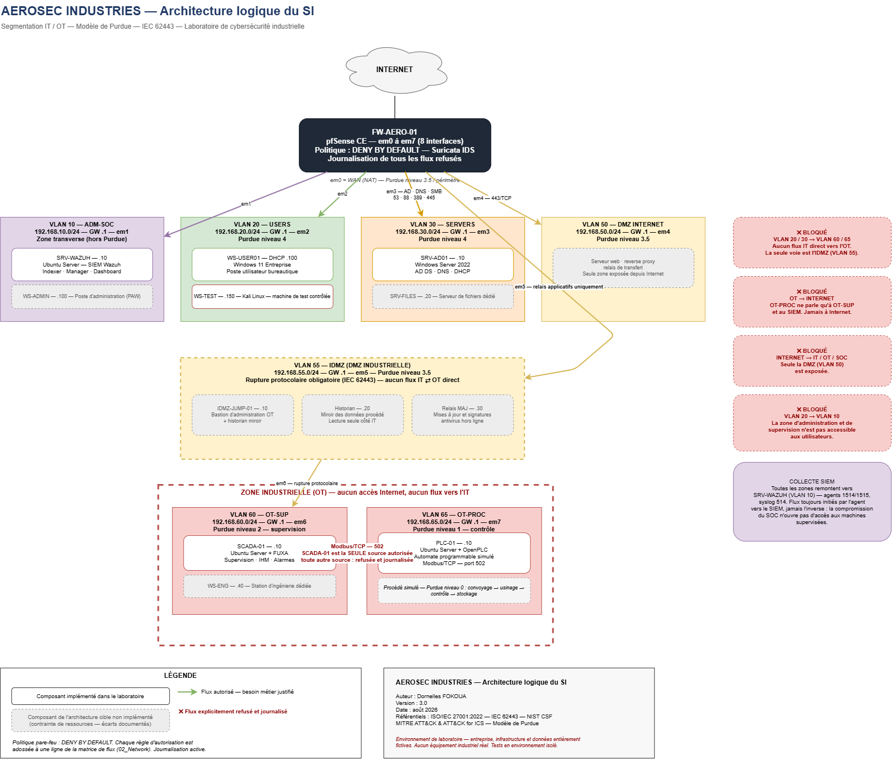

# AEROSEC INDUSTRIES — Sécurisation d'un SI industriel aéronautique

Lab de conception et de sécurisation du système d'information d'une entreprise
aéronautique fictive, couvrant les environnements IT et OT.

**Statut :** Phase 0 — Préparation ✅ | Phase 1 — Architecture 🔄

## Périmètre
Segmentation réseau · Active Directory · environnement industriel simulé (OpenPLC / SCADA)
· SIEM Wazuh · IDS Suricata · scénarios de détection · analyse de risques

## Référentiels
ISO/IEC 27001:2022 · NIST CSF · IEC 62443 · Purdue Model · MITRE ATT&CK & ATT&CK for ICS

## Avertissement
Entreprise, infrastructure et données entièrement fictives. Aucun équipement
industriel réel n'est utilisé. Tous les tests sont réalisés en environnement isolé.

## Architecture

